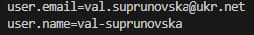
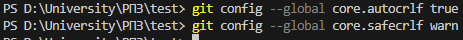
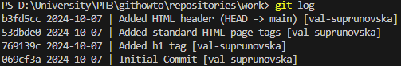

# Список лабораторних робіт:
+ [Прейти до лабораторної "Вивчення Git"](#лабораторна-вивчення-git)
+ [Прейти до лабораторної "Вивчення Docker"](#лабораторна-вивчення-docker)
+ [Перейти до лабораторної "Реалізація перетворень між системами координат"](https://github.com/val-suprunovska/coordinate-system)
+ [Перейти до лабораторної "Розробка додатку для візуалізації вимірювань радару"](https://github.com/val-suprunovska/radar)
+ [Перейти до лабораторної "Розробка додатку для візуалізації вимірювань GPS"](https://github.com/val-suprunovska/gps)
+ [Перейти до лабораторної "Розробка додатку для візуалізації вимірювань LORAN"](https://github.com/val-suprunovska/loran)
+ [Перейти до лабораторної "Дослідження фільтра Калмана"](https://github.com/val-suprunovska/kalmanfilter)

___
# Лабораторна "Вивчення Git"

### *01* Встановлюю ім'я та адресу електронної пошти
  

Результат:  

### *02* Назва гілки за замовчуванням

### *03* Коректна обробка закінчень рядків

## Створення проєкту
### *01* Створюю сторінку «Hello, World»

Замість "touch hello.html" пишу "New-Item hello.html -ItemType File"

### *02* Створюю репозиторій

### *03* Додаю сторінку у репозиторій

## Перевірка стану
### *01* Перевіряю стан репозиторія

## Внесення змін
### *01* Змінюю сторінку «Hello, World»
### *02* Перевіряю стан

## Індексація змін
### *01* Додаю зміни

## Коміт змін
### *01* Коміт зміни

Результат:  

### *02* Перевіряю стан

## Зміни, а не файли
### *01* Перша зміна: Додаю стандартні теги сторінок
### *02* Додаю ці зміни
### *03* Друга зміна: Додаю заголовок HTML
### *04* Перевіряю поточний статус

### *05* Коміт

### *06* Додаю другу зміну

### *07* Роблю коміт другої зміни

## Історія проєкту
### *01* Однорядкова історія

### *02* Кінцевий формат історії

+ ` --pretty="..."` — визначає формат виходу.
+ `%h` — скрочений хеш коміту.
+ `%ad` — дата коміту.
+ `|` візуальний роздільник.
+ `%s` — коментар.
+ `%d` — доповнення коміту («голови» гілок та теги).
+ `%an` — ім'я автора.
+ `--date=short` — зберігає формат дати коротким і симпатичним.

## Отримання старих версій
### *01* Отримую хеші попередніх комітів

### *02* Повертаюся до останньої версії в гілці `main`

## Створення тегів версій
### *01* Створюю тег першої версії

### *02* Теги для попередніх версій

### *03* Перемикання за ім'ям тегу

### *04* Перегляд тегів за допомогою команди `tag`

### *05* Перегляд тегів у логах

## Скасування локальних змін (до індексації)
### *01* Переходжу на гілку `main`
### *02* Змінюю `hello.html`
### *03* Перевіряю стан

### *04* Скасування змін в робочій директорії

## Скасування проіндексованих змін (перед комітом)
### *01* Вношу зміни у файл і індексую їх
### *02* Перевіряю стан

### *03* Скасовую індексацію змін
### *04* Переходжу на версію коміту

## Скасування комітів
### *01* Змінюю файл і роблю коміт
### *02* Роблю коміт з новими змінами, що скасовують попередні

### *03* Перевіряю лог

## Видалення комітів з гілки (revert)
### *01* Команда `reset`
### *02* Перевіряю історію
### *03* Для початку позначаю цю гілку
### *04* Відкіт до коміту, що передує до `oops`

## Видалення тегу `oops`

## Внесення змін до комітів
### *01* Змінюю сторінку, а потім роблю коміт
### *02* Змінюю попередній коміт

## Створення гілки
### *01* Створюю гілку

### *02* Додаю файл стилів `style.css`

### *03* Змінюю hello.html для того, щоб використовувати `style.css`

## Перемикання гілок
### *01* Перемикання на гілку `main`
### *02* Повертаюсь до гілки `style`

## Переміщення файлів
### *01* Перегляд історії змін конкретного файлу

### *02* Перегляд різниці між версіями певного файлу

### *03* Перейменовую `hello.html`

### *04* Безпечне переміщення файлу `style.css`

## Зміни в гілці `main`
### *01* Створюю файл `README`
### *02* Коміт файлу `README` у гілку `main`

## Перегляд розбіжних гілок
### *01* Переглядаю поточні гілки

## Злиття
### *01* Злиття гілок

## Створення конфлікту
### *01* Повертаюся у `main` і створюю конфлікт
### *02* Перегляд гілок

## Вирішення конфліктів
### *01* Злиття main до гілки `style`

### *02* Скасування злиття
### *03* Рішення конфлікту
### *04* Роблю коміт з розв'язаним конфліктом

## Відкочування гілки `style`
### *01* Відкочую гілку `style`
### *02* Перевіряю гілку

## Перебазування
### *01* Перебазовую гілку `style` на `main`

### *02* Розв'язую конфлікт

## Злиття в гілку `main`
### *01* Злиття `style` в `main`
### *02* Переглядаю логи

## Клонування репозиторіїв
### *01* Переходжу в директорію `repositories`
### *02* Створюю клон репозиторія `work`

## Перегляд клонованого репозиторія
### *01* Переглядаю історію репозиторія

## Що таке origin?

## Віддалені гілки
### *01* Список віддалених гілок

## Зміна оригінального репозиторія
### *01* Вношу зміни в оригінальний репозиторій `work`

## Підтягування змін
### *01* Перевіряю README

## Злиття підтягнутих змін
### *01* Зливаю підтягнуті зміни в локальну гілку `main`
### *02* Ще раз перевіряю файл README

## Додавання гілки відстеження
### *01* Додаю локальну гілку, котра відстежує віддалену гілку

## Чисті репозиторії
### *01* Створюю чистий репозиторій

## Додавання віддаленого репозиторія

### *01* Додаю репозиторій work.git до оригінального репозиторія.  
`cd work`  
`git remote add shared ../work.git`

## Відправка змін

## Підтягування спільних змін

____

# Лабораторна "Вивчення Docker"

### Запускаю перший контейнер

Для цього контейнера інтерфейс доступний через порт 8080. Відкриваю у браузері localhost

### Запускаю другий контейнер 
Програма завантажилася 

Вношу зміни у файл `backend/src/routes/getGreeting.js`, а потім в плейсхолдер

Вношу зміни до `index.scss`

